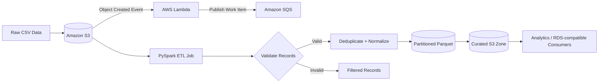

<div align="center">

# ☁️ Cloud ETL & Streaming Data Pipeline

**A distributed, event-driven data engineering project built with PySpark and AWS services.**


</div>

---

## 🚀 Overview

This project demonstrates a resilient cloud data pipeline that combines **distributed batch processing** with **event-driven AWS workflows**. Raw objects are detected through S3 events, queued through SQS for decoupled processing, and transformed with PySpark into analytics-ready Parquet data.

The implementation focuses on practical data-engineering concerns: **validation, deduplication, schema consistency, timestamp normalization, partitioned output, retry-friendly messaging, and scalable processing**.

## 🏗️ Architecture



### Data flow

`S3 ingestion → Lambda event → SQS message → PySpark transform → validation → deduplication → Parquet → curated data`

---

## ✨ Key Features

| Capability | Implementation |
|---|---|
| Distributed processing | Apache Spark / PySpark |
| Cloud ingestion | Amazon S3 |
| Event handling | AWS Lambda |
| Decoupled messaging | Amazon SQS |
| Data quality | Required-field validation and malformed-record filtering |
| Data consistency | Business-key deduplication and timestamp normalization |
| Analytics-ready output | Partitioned Parquet |
| Resiliency pattern | Retry/DLQ-friendly queue-based architecture |
| Testing | Python `unittest` for Lambda event handling |

---

## 🧰 Tech Stack

**Languages & Processing**  
Python • PySpark • Apache Spark

**AWS**  
Amazon S3 • AWS Lambda • Amazon SQS • RDS-compatible downstream persistence

**Data Engineering**  
ETL • Data Validation • Deduplication • Partitioning • Parquet • Event-Driven Processing

---

## 📁 Repository Structure

```text
.
├── .github/
│   └── workflows/
│       └── ci.yml
├── README.md
├── etl_job.py
├── lambda_handler.py
├── requirements.txt
├── sample_data/
│   └── transactions.csv
└── tests/
    └── test_lambda_handler.py
```

---

## ⚡ Quick Start

### 1. Install dependencies

```bash
python -m pip install -r requirements.txt
```

### 2. Run locally with sample data

```bash
spark-submit etl_job.py \
  --input sample_data/transactions.csv \
  --output output/curated
```

### 3. Run with S3 paths

```bash
spark-submit etl_job.py \
  --input s3://your-bucket/raw/ \
  --output s3://your-bucket/curated/
```

---

## ⚙️ Lambda Configuration

Set the queue URL as an environment variable:

```text
PROCESSING_QUEUE_URL=<your-sqs-queue-url>
```

The Lambda handler accepts standard **Amazon S3 object-created notifications** and publishes one processing message to SQS per uploaded object.

---

## 🧪 Testing

Run the unit tests with:

```bash
python -m unittest discover -s tests
```

The test suite validates the event-to-message workflow without requiring a live AWS environment.

---

## 💡 Engineering Concepts Demonstrated

- Distributed ETL design with Spark
- Event-driven cloud architecture
- Producer/consumer decoupling
- Data-quality validation
- Idempotency-oriented deduplication
- Analytics-oriented columnar storage
- Cloud-native retry and DLQ patterns
- Testable serverless integration boundaries

---

## 🎯 Portfolio Context

This repository is a portfolio implementation of the **Cloud ETL & Streaming Data Pipeline** described on my resume. It is designed to demonstrate practical experience with **Python, PySpark/Spark, ETL workflows, AWS S3, Lambda, SQS, resilient processing, and cloud-oriented data engineering**.

<div align="center">

**Built by [Akash Perla](https://github.com/Akashperla)**

</div>
